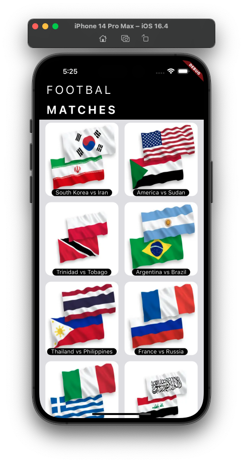
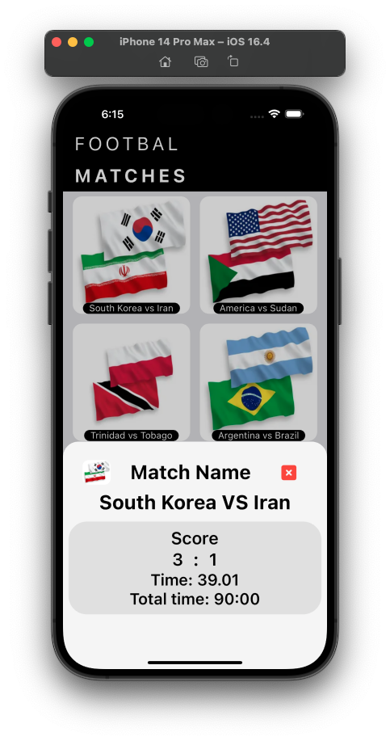
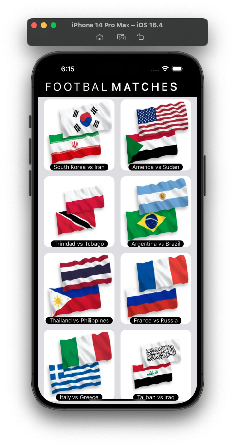
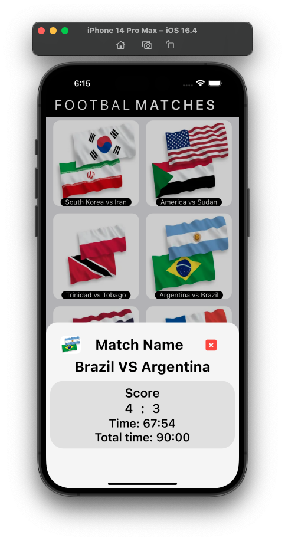

# mod14asgmt

## Football Match List App
The Football Matches App is a simple Flutter application that allows users to view a list of football matches. The app fetches match data from a Firebase Cloud Firestore and displays it in a user-friendly interface.

## App Preview

## Features
Match List Screen: The app opens to a Match List Screen, where users can see a list of football matches. Each match entry displays relevant information such as team names, goals, and time.

Realtime Updates: The app maintains a connection to the Firebase Cloud Firestore, ensuring that any changes or additions to the match data are reflected in real-time on the Description Sheet.

Manually Added Matches: The match data displayed in the app is manually added to the Firebase Cloud Firestore. The app demonstrates how to structure the data and retrieve it for display.
