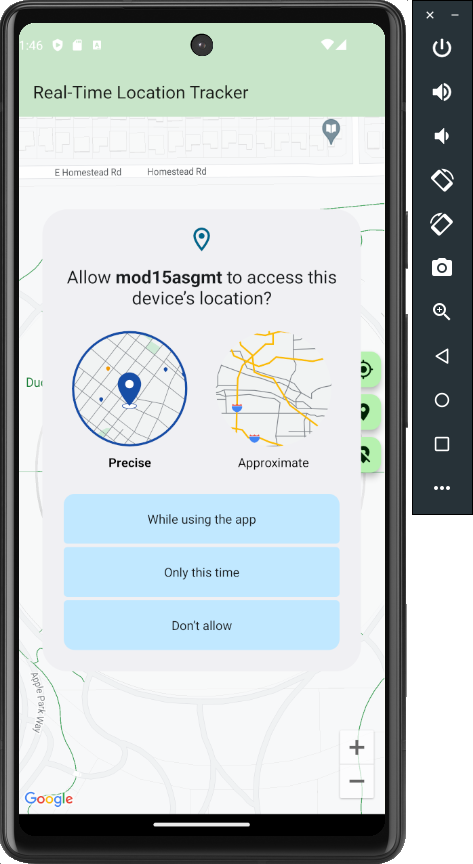
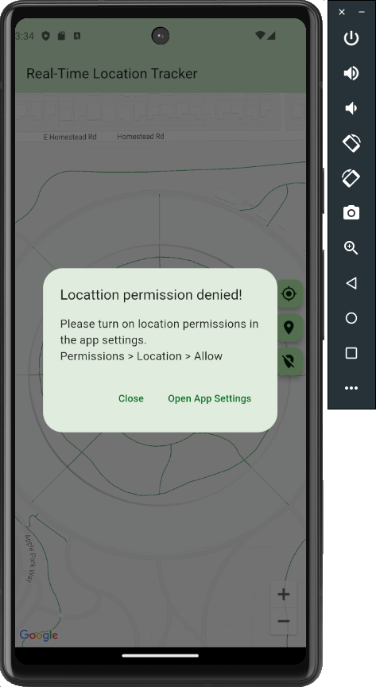
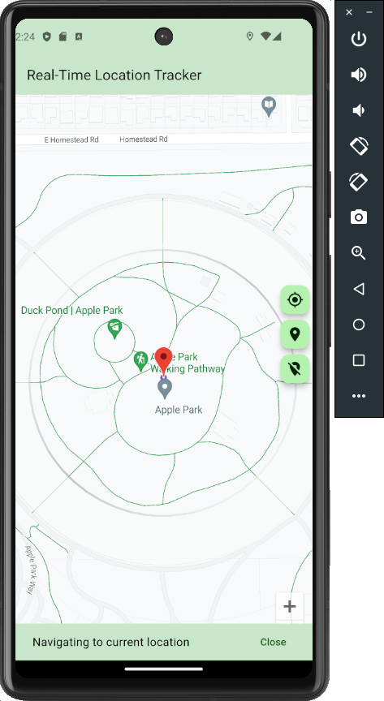
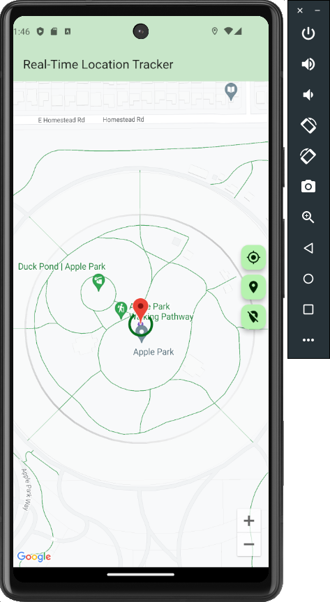
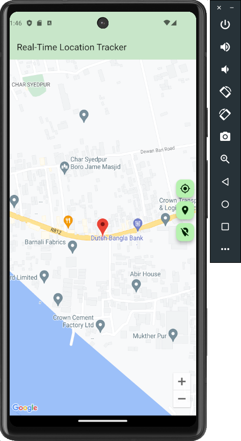
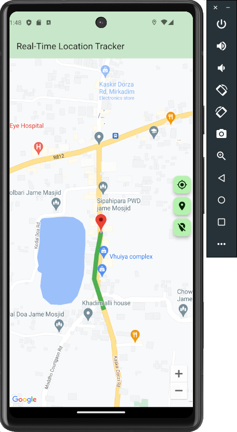
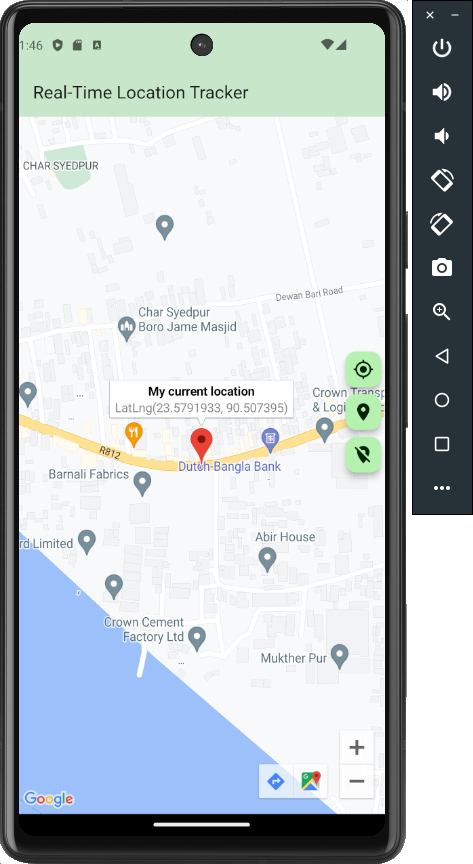

# mod15asgmt

# A Real-Time Location Tracking App with Google Maps and Flutter

## App View

# Seaking for Location Permission

# Automatic Map Animation

# Real-Time Location Updates & Polyline Tracking

# Marker Information Window

## Real-Time Location Tracking App
This is a Flutter app that demonstrates real-time location tracking on a Google Map. The app displays the user's current location on the map, updates the location marker every 10 seconds, draws a polyline to show the path, and provides additional details about the location through an info window.

Features
1. Automatic Map Animation:

The Google Map view smoothly animates to the user's current location upon opening the app.

2. Real-Time Location Updates:

The app fetches the user's current location every 10 seconds using location services.

3. Polyline Tracking:

A polyline is drawn on the map, connecting the user's previous and current locations.
The polyline updates in real-time as the user's location changes.

4. Marker Information Window:

Users can tap the location marker to open an info window.
The info window displays the title "My current location" and the user's latitude and longitude as the snippet.