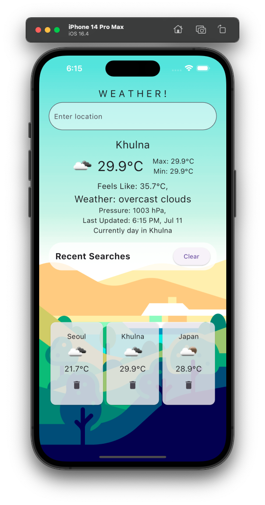
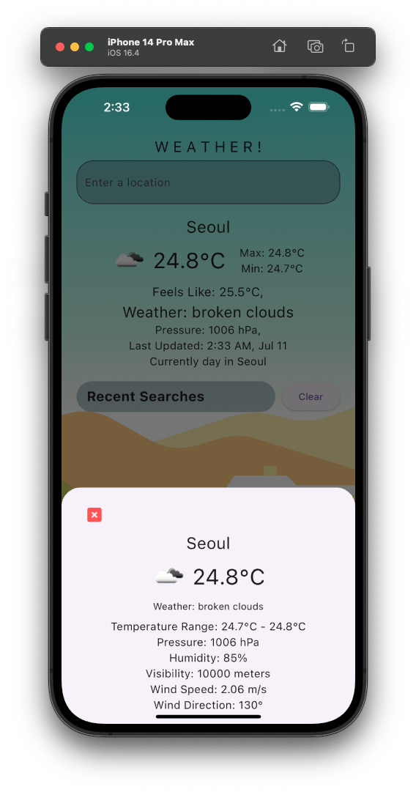
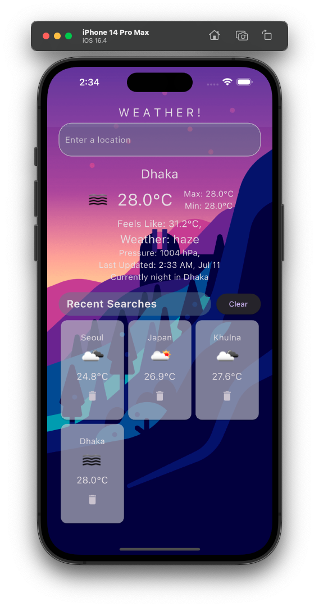
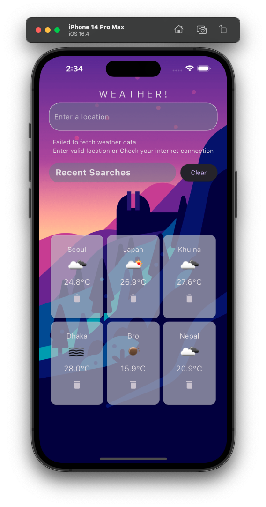

# mod8asgmt

A flutter project for the assignment of module 9

## W E A T H E R !

## Full app view

W E A T H E R ! is a simple and intuitive application that allows users to check the current weather conditions for different locations. With a clean and visually appealing interface, users can easily enter a location and get real-time weather information.

Key features of the Weather app include:

Real-Time Weather Updates: The app fetches weather data from the OpenWeatherMap API, providing accurate and up-to-date information about the temperature, weather description, and weather icon for the specified location.

Temperature Details: Users can view the current temperature in Celsius along with the maximum and minimum temperatures for the day. The app also displays the "Feels Like" temperature, providing insights into how the weather feels to the user.

Weather Description: The app provides a brief description of the weather conditions, such as "Cloudy," "Rainy," or "Sunny," giving users an overview of the current weather situation.

Last Updated Time: Users can see the timestamp indicating when the weather information was last updated. Tapping on the timestamp triggers a refresh action, allowing users to fetch the latest weather data for the selected location.

Recent Searches: The app keeps track of recently searched locations, making it convenient for users to revisit previously searched locations and quickly access their weather information. Recent searches are displayed in a grid format, showing the location name, temperature, and a weather icon.

Interactive User Experience: Users can tap on a recent search item to view detailed weather information for that location, including weather icons, temperature range, pressure, humidity, visibility, wind speed, and wind direction. Long-pressing on a recent search item opens a modal bottom sheet displaying comprehensive weather details.

Day/Night Mode: The app automatically adjusts its theme based on the time of day, providing a light theme during the day and a dark theme during the night. This ensures optimal visibility and enhances the user experience.

The Weather app provides a convenient way for users to stay informed about the current weather conditions and plan their activities accordingly. With its user-friendly interface and reliable weather data, users can rely on this app to get accurate weather information for any desired location.