# Flutter Practice

Welcome to my Flutter Practice Repository! This repository contains a collection of Flutter practice projects that I am completing as part of my learning journey on the Ostad platform.

## About Ostad Learning Platform

[Ostad](https://ostad.app) is a learning platform that provides high-quality educational content and resources for mastering various skills, including Flutter app development.

## Folder Structure

### Assignments

The "Assignments" folder contains Flutter projects that I've worked on as part of assignments and exercises provided on the Ostad platform. These projects focus on specific concepts and skills, helping me to solidify my understanding of Flutter development.

Projects in this folder:
01. Assignment [Project 01 Module 5](https://github.com/muj-i/Flutter-Practice/tree/main/Assignments/mod5asgmt):

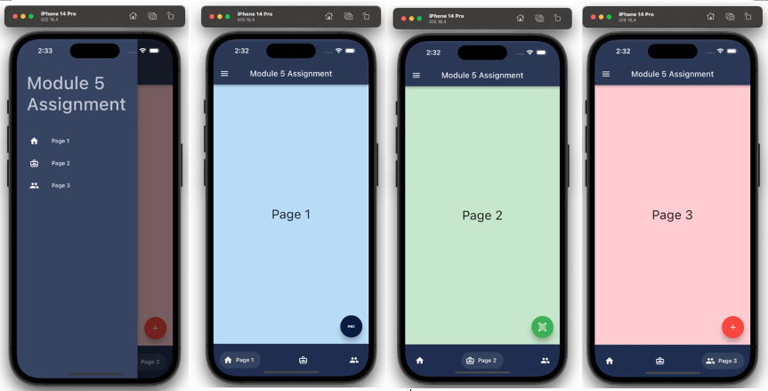

02. Assignment [Project 02 Module 6](https://github.com/muj-i/Flutter-Practice/tree/main/Assignments/mod6asgmt):

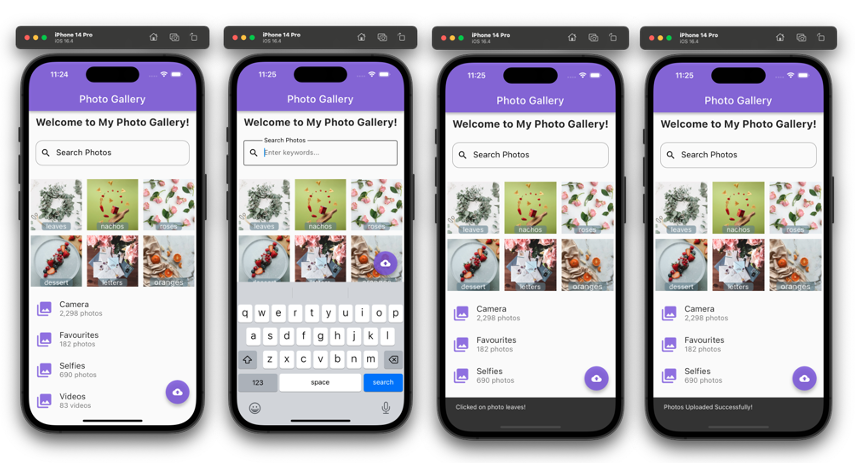

03. Assignment [Project 03 Module 7](https://github.com/muj-i/Flutter-Practice/tree/main/Assignments/mod7asgmt):
   
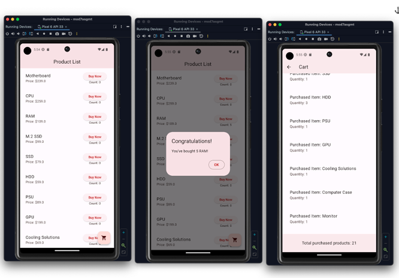

04. Assignment [Project 04 Module 8](https://github.com/muj-i/Flutter-Practice/tree/main/Assignments/mod8asgmt):

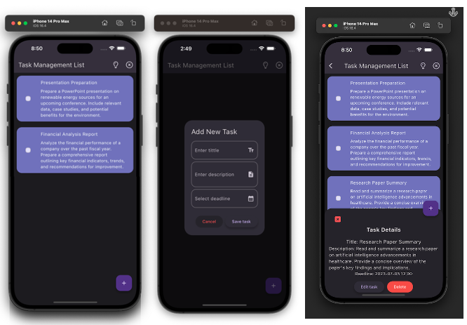

05. Assignment [Project 05 Module 9](https://github.com/muj-i/Flutter-Practice/tree/main/Assignments/mod9asgmt):

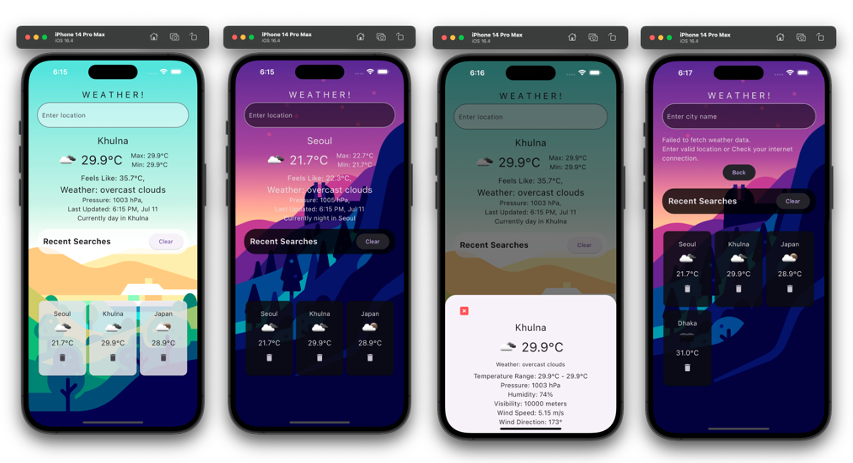

06. Assignment [Project 06 Module 10](https://github.com/muj-i/Flutter-Practice/tree/main/Assignments/mod10asgmt):

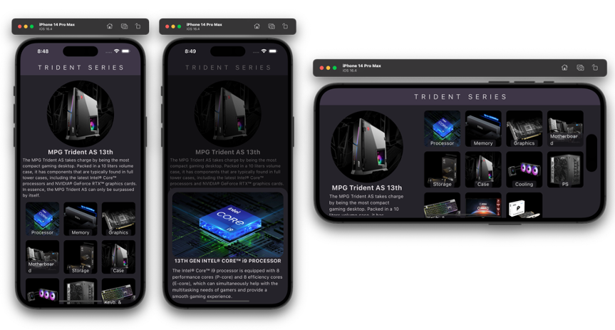

07. Assignment [Project 07 Module 13](https://github.com/muj-i/progress_pal):

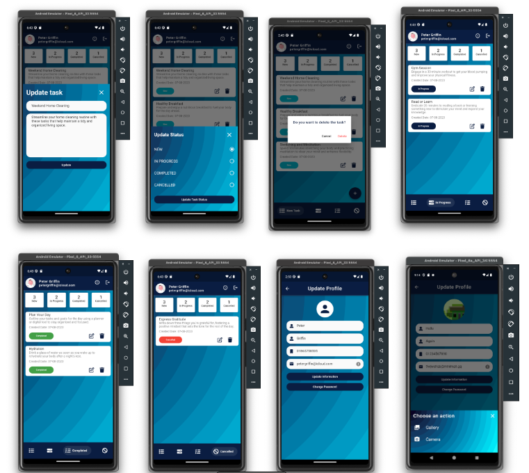

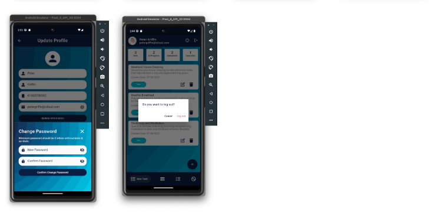

08. Assignment [Project 08 Module 14](https://github.com/muj-i/Flutter-Practice/tree/main/Assignments/mod14asgmt):

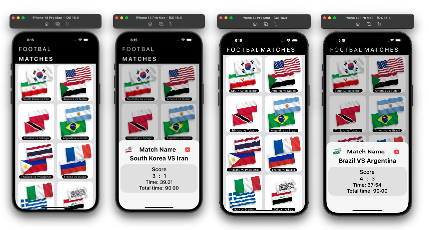

09. Assignment [Project 09 Module 15](https://github.com/muj-i/Flutter-Practice/tree/main/Assignments/mod15asgmt):

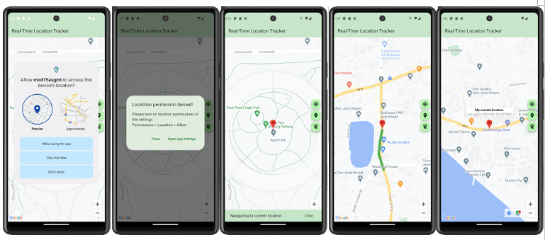

10. Assignment [Project 10 Module 16](https://github.com/muj-i/crafty_bay):

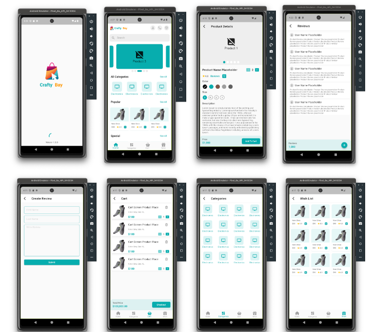

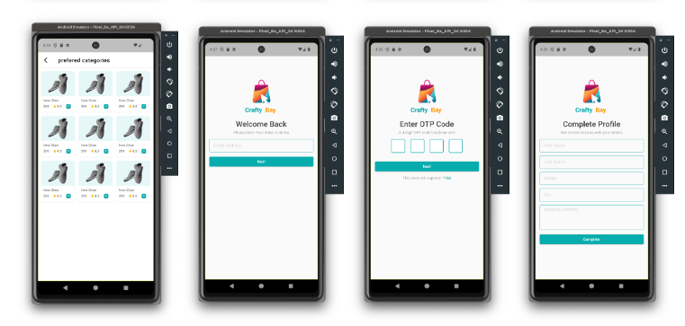

### Live Test

The "Live tests" folder contains Flutter projects that were designed for live coding tests and assessments on the Ostad platform. These projects simulate real-world scenarios and challenge my problem-solving skills in a timed environment.

Projects in this folder:
1. Live Test Project 1:
<a href="https://github.com/muj-i/Flutter-Practice/tree/main/LiveTests/mod5lt">Module 5 Live Test</a>
2. Live Test Project 2:
<a href="https://github.com/muj-i/Flutter-Practice/tree/main/LiveTests/mod6lt">Module 6 Live Test</a>
3. Live Test Project 3:
<a href="https://github.com/muj-i/Flutter-Practice/tree/main/LiveTests/mod7lt">Module 7 Live Test</a>
4. Live Test Project 4:
<a href="https://github.com/muj-i/Flutter-Practice/tree/main/LiveTests/mod8lt">Module 8 Live Test</a>
5. Live Test Project 5:
<a href="https://github.com/muj-i/Flutter-Practice/tree/main/LiveTests/mod9lt">Module 9 Live Test</a>
6. Live Test Project 6:
<a href="https://github.com/muj-i/Flutter-Practice/tree/main/LiveTests/mod10lt">Module 10 Live Test</a>

## How to Use

Feel free to explore the individual project folders to learn more about the specific assignments and live tests I've completed. Each project folder includes a README or description that provides details about the project's goals and requirements.

If you're also learning Flutter on Ostad, these projects could serve as a reference or source of inspiration for your own learning journey. Happy coding!

## License

This repository is licensed under the [MIT License](LICENSE).

## Disclaimer

Please note that the projects and their content are related to my learning experience on the Ostad platform. They may not necessarily represent official course content or solutions provided by Ostad.
